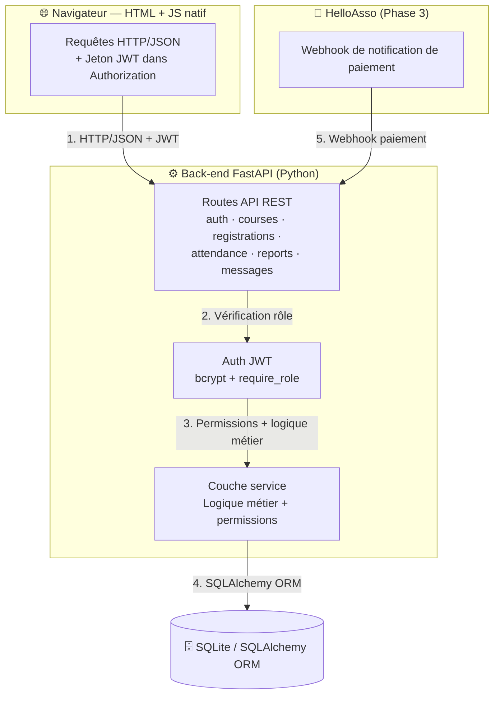

# Documentation technique — Portfolio Project (Stage 3)

Plateforme de cours pour association scolaire

Le présent document constitue la documentation technique du projet Portfolio (Stage 3) : une plateforme de cours à distance destinée à une association scolaire. Le MVP permet d'organiser des cours à distance le week-end pour environ 100 élèves et 10 professeurs. La solution s'appuie sur une stack FastAPI + SQLAlchemy + SQLite + JWT, avec une interface HTML/JavaScript native.

## 2. Architecture système

### 2.1 Vue d'ensemble

L'architecture repose sur une séparation stricte en trois couches : un client léger (navigateur), un back-end applicatif (FastAPI) et un système de stockage (SQLite via SQLAlchemy). Un service externe (HelloAsso) s'intègre en phase 3 uniquement, via webhook.

### 2.2 Composants

| # | Composant | Technologie | Rôle |
| --- | --- | --- | --- |
| 1 | Navigateur | HTML + JS natif | Envoie des requêtes HTTP/JSON vers l'API, avec un jeton JWT dans l'en-tête `Authorization` sur les routes protégées |
| 2 | Back-end | FastAPI (Python) | Routes API REST (auth, courses, registrations, attendance, reports, messages), authentification JWT (bcrypt + `require_role`), couche service (logique métier + permissions) |
| 3 | Base de données | SQLite / SQLAlchemy ORM | Stockage persistant ; évolution vers PostgreSQL possible sans réécriture du code métier |
| 4 | Services externes | HelloAsso (phase 3) | Webhook de notification de paiement |

#### 2.2.1 Navigateur (HTML + JS natif)

L'interface est un ensemble de pages HTML servies par le back-end, enrichies de JavaScript natif (aucun framework). Le navigateur communique exclusivement avec l'API via des requêtes HTTP/JSON :

- **Routes publiques** (connexion, inscription) : requêtes sans jeton.
- **Routes protégées** : envoi d'un jeton JWT dans l'en-tête `Authorization: Bearer <token>`.

#### 2.2.2 Back-end FastAPI (Python)

Le back-end expose une API REST organisée en six domaines fonctionnels :

- `auth` : connexion, inscription, gestion de session (JWT).
- `courses` : création et consultation des cours (professeur, agenda élève).
- `registrations` : demandes d'inscription et validation (parent, staff).
- `attendance` : saisie assiduité et signalements absence/retard.
- `reports` : progression des élèves, rapports de disponibilité professeurs.
- `messages` : messagerie descendante (staff → familles).

L'authentification repose sur **JWT** (mots de passe hachés avec **bcrypt**) et sur la dépendance **`require_role`**, qui protège chaque route selon le rôle de l'utilisateur (élève, parent, professeur, staff).

La logique métier est isolée dans une **couche service**, qui applique les permissions par rôle avant tout accès aux données.

#### 2.2.3 Base de données SQLite / SQLAlchemy ORM

Le stockage est assuré par SQLite, accessible uniquement via l'ORM SQLAlchemy. Cette abstraction garantit la migration vers PostgreSQL en phase de production **sans réécriture du code métier** (changement de la chaîne de connexion et des dépendances uniquement).

#### 2.2.4 Services externes — HelloAsso (phase 3)

Hors périmètre MVP, l'intégration HelloAsso permet l'automatisation des cotisations : HelloAsso reçoit le paiement puis notifie le back-end via **webhook**, déclenchant la mise à jour du statut de paiement côté plateforme.

#### 2.2.5 Conteneurisation et déploiement (Docker)

Le back-end FastAPI est packagé dans une **image Docker** unique (application + dépendances Python), ce qui garantit un environnement d'exécution identique entre le poste de développement, la préproduction et la production. SQLite est monté en volume en v1 ; le passage à PostgreSQL en v2 se traduit par un conteneur de base de données supplémentaire, sans changement du code applicatif grâce à l'ORM SQLAlchemy (voir 2.2.3). La conteneurisation n'est activée qu'à partir du déploiement de **préproduction** (voir pipeline CI/CD, section 6.3) ; l'environnement local de développement peut tourner sans Docker (`uvicorn` direct) pour un cycle de développement plus rapide.

### 2.3 Flux de données

1. Le navigateur envoie des requêtes HTTP/JSON vers l'API FastAPI, avec un jeton JWT dans l'en-tête `Authorization` sur les routes protégées.
2. La dépendance `require_role` vérifie le rôle avant d'exécuter toute action ; le rôle est présent dans le jeton et re-vérifié en base si nécessaire.
3. La couche service applique les permissions par rôle (un parent n'accède qu'aux données de ses enfants) puis interroge la base via SQLAlchemy.
4. SQLite stocke les données (évolution vers PostgreSQL sans réécriture, grâce à l'ORM).
5. Phase 3 : HelloAsso reçoit le paiement et notifie le back-end via webhook.

### 2.4 Décisions d'architecture

| Décision | Justification |
| --- | --- |
| JS natif sans framework | Simplicité, zéro dépendance build, périmètre adapté au MVP |
| FastAPI + Pydantic | Typage statique, validation des requêtes, documentation OpenAPI générée automatiquement |
| JWT + bcrypt | Sessions sans état (évolutif) et hachage robuste des mots de passe |
| `require_role` par dépendance | Contrôle d'accès centralisé, appliqué au niveau des routes |
| Couche service dédiée | Séparation logique métier / accès données, permissions appliquées en un point unique |
| SQLAlchemy ORM | Indépendance vis-à-vis de la base (SQLite → PostgreSQL sans réécriture) |
| Docker en préproduction/production | Environnement d'exécution reproductible, prépare la bascule PostgreSQL sans changer le code applicatif |
| Webhook HelloAsso (phase 3) | Intégration découplée : le back-end n'appelle pas HelloAsso, il réagit à ses notifications |

### 2.5 Évolution prévue (hors MVP)

- Migration SQLite → PostgreSQL en production.
- Intégration HelloAsso (webhook de paiement) en phase 3.
- Option envisagée (non retenue pour le MVP) : messagerie temps réel et API Zoom.
