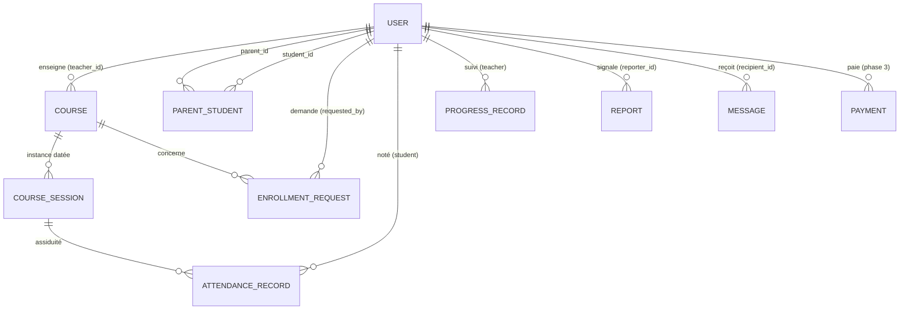

# Documentation technique — Portfolio Project (Stage 3)

Plateforme de cours pour association scolaire

Le présent document constitue la documentation technique du projet Portfolio (Stage 3) : une plateforme de cours à distance destinée à une association scolaire. Le MVP permet d'organiser des cours à distance le week-end pour environ 100 élèves et 10 professeurs. La solution s'appuie sur une stack FastAPI + SQLAlchemy + SQLite + JWT, avec une interface HTML/JavaScript native.

## 3. Composants, classes et conception de la base de données

### 3.1 Classes principales (back-end — SQLAlchemy + FastAPI)

| Classe | Champs | Rôle |
| --- | --- | --- |
| `User` | id, email, password_hash, role (student/parent/teacher/staff), first_name, last_name, birth_date, is_active, last_login | Compte générique ; majorité calculée via `birth_date` ; `last_login` alimente le suivi de disponibilité des profs (section 5.2.2) |
| `ParentStudent` (table d'association) | parent_id, student_id | Relation N:N parent ↔ enfant |
| `Course` | id, teacher_id, title, subject, day_of_week, start_time, end_time, zoom_link | Cours hebdomadaire créé par le prof |
| `EnrollmentRequest` | id, student_id, course_id, requested_by_id, status (pending/approved/rejected), handled_by_id | Demande d'inscription soumise au staff |
| `CourseSession` | id, course_id, date, zoom_link | Instance datée d'un cours (pour l'assiduité) |
| `AttendanceRecord` | id, session_id, student_id, status (present/absent/late), note | Assiduité renseignée par le prof |
| `ProgressRecord` | id, student_id, course_id, teacher_id, level, note, date | Suivi de progression |
| `Report` | id, reporter_id, student_id, type (absence/late), status (open/processing/resolved), note | Signalement parent/élève majeur → staff |
| `Message` | id, sender_id, recipient_id, title, body, sent_at | Messagerie descendante staff → parent OU élève majeur |
| `Payment` (phase 3) | id, student_id, amount, helloasso_payment_id, status | Cotisation HelloAsso |

#### 3.1.1 Méthodes clés par classe

Seules les méthodes porteuses de **logique métier** sont listées ci-dessous ; les opérations CRUD triviales (créer/lire/mettre à jour une ligne) sont gérées implicitement par l'ORM SQLAlchemy et ne sont pas détaillées.

| Classe | Méthode | Rôle |
| --- | --- | --- |
| `User` | `verify_password(plain_password) -> bool` | Compare le mot de passe fourni au `password_hash` stocké via bcrypt (voir diagramme de séquence 4.2) |
| `User` | `is_adult() -> bool` | Calcule la majorité à la volée à partir de `birth_date` (voir 3.5) — jamais stockée |
| `User` | `generate_token() -> str` | Construit le jeton JWT signé, incluant le rôle (utilisé par le service d'authentification lors du login) |
| `Course` | `add_session(date, zoom_link=None) -> CourseSession` | Crée une nouvelle instance datée rattachée au cours |
| `Course` | `is_owned_by(teacher_id) -> bool` | Vérifie que `teacher_id` correspond bien au professeur du cours (permission utilisée par la couche service, ex. `POST /api/attendance`) |
| `CourseSession` | `effective_zoom_link() -> str` | Retourne son propre `zoom_link` s'il est renseigné, sinon celui du `Course` parent (règle de résolution, voir 3.5) |
| `EnrollmentRequest` | `approve(handled_by_id) -> None` | Passe `status` à `approved` et renseigne `handled_by_id` |
| `EnrollmentRequest` | `reject(handled_by_id) -> None` | Passe `status` à `rejected` et renseigne `handled_by_id` |
| `Report` | `resolve(handled_by_id) -> None` | Passe `status` à `resolved` et renseigne `handled_by_id` |
| `Payment` (phase 3) | `update_status(helloasso_status) -> None` | Met à jour `status` à partir du payload reçu par le webhook HelloAsso |

`ParentStudent`, `AttendanceRecord`, `ProgressRecord` et `Message` sont des entités de données pures : aucune méthode métier au-delà de la persistance standard (leur logique de permission — ex. « un parent n'accède qu'aux données de ses enfants » — est portée par la couche service, pas par la classe elle-même).

### 3.2 Relations principales (ERD)

| Relation | Cardinalité | Description |
| --- | --- | --- |
| `USER` — `COURSE` | 1 — N | Un professeur enseigne plusieurs cours |
| `COURSE` — `COURSE_SESSION` | 1 — N | Un cours a plusieurs instances datées |
| `USER` — `PARENT_STUDENT` | N — N | Un parent a plusieurs enfants ; un enfant peut avoir deux parents |
| `USER` — `ENROLLMENT_REQUEST` | 1 — N | Un utilisateur émet plusieurs demandes |
| `COURSE` — `ENROLLMENT_REQUEST` | 1 — N | Une demande concerne un seul cours |
| `COURSE_SESSION` — `ATTENDANCE_RECORD` | 1 — N | Une session reçoit plusieurs relevés d'assiduité |
| `USER` — `ATTENDANCE_RECORD` | 1 — N | Un élève est noté sur plusieurs sessions |
| `USER` — `PROGRESS_RECORD` | 1 — N | Un professeur suit la progression de ses élèves |
| `USER` — `REPORT` | 1 — N | Un utilisateur émet des signalements |
| `USER` — `MESSAGE` | 1 — N | Un utilisateur reçoit des messages |
| `USER` — `PAYMENT` | 1 — N | Un utilisateur effectue des paiements (phase 3) |

### 3.3 Détail des tables

| Table | Champs | Contraintes & notes |
| --- | --- | --- |
| `users` | id, email, password_hash, role, first_name, last_name, birth_date, is_active, last_login, created_at | `email` **unique** ; `last_login` mis à jour à chaque `POST /api/auth/login` réussi |
| `parent_student` | parent_id, student_id | Clé primaire **composite** ; `parent_id` FK → users, `student_id` FK → users |
| `courses` | id, teacher_id, title, subject, day_of_week, start_time, end_time, zoom_link | `teacher_id` FK → users |
| `enrollment_requests` | id, student_id, course_id, requested_by_id, status (pending/approved/rejected), handled_by_id, created_at | `student_id` FK, `course_id` FK, `requested_by_id` FK, `handled_by_id` FK |
| `course_sessions` | id, course_id, date, zoom_link | `course_id` FK ; `zoom_link` nullable (voir 3.5) |
| `attendance_records` | id, session_id, student_id, status, note, created_at | `session_id` FK, `student_id` FK |
| `progress_records` | id, student_id, course_id, teacher_id, level, note, date | `student_id` FK, `course_id` FK, `teacher_id` FK |
| `reports` | id, reporter_id, student_id, type, status, note, created_at, handled_by_id | `reporter_id` FK, `student_id` FK |
| `messages` | id, sender_id, recipient_id, title, body, sent_at | `sender_id` FK, `recipient_id` FK |
| `payments` (phase 3) | id, student_id, amount, helloasso_payment_id, status, date | `student_id` FK |

### 3.4 Front-end (composants et interactions)

| Composant | Rôle | Endpoints appelés (via `api_client.js`) |
| --- | --- | --- |
| `api_client.js` | Client API central : ajoute automatiquement l'en-tête `Authorization: Bearer <token>` sur les appels protégés, centralise la gestion des erreurs `401` (déconnexion + redirection vers `login`) | — (utilisé par toutes les pages ci-dessous) |
| Page `login` | Connexion (email + mot de passe) | `POST /api/auth/login` |
| Page `register` | Inscription (élève / parent uniquement, voir 5.2.1 de la Spécification API) | `POST /api/auth/register` |
| Page `agenda` | Agenda élève : prochaines sessions + lien Zoom ; consultation des cours disponibles et demande d'inscription | `GET /api/courses/upcoming`, `GET /api/courses`, `POST /api/registrations` |
| Page `parent` | Portail parent : liste des enfants, agenda/assiduité/progression par enfant, signalement d'absence | `GET /api/courses/upcoming`, `GET /api/students/{id}/attendance`, `POST /api/registrations`, `POST /api/reports` |
| Page `prof` | Tableau de bord professeur : création de cours et de sessions, saisie d'assiduité et de progression | `GET /api/courses`, `POST /api/courses`, `POST /api/courses/{id}/sessions`, `POST /api/attendance`, `POST /api/progress` |
| Page `admin` | Administration staff : validation des inscriptions, création des comptes professeurs, traitement des signalements, messagerie, suivi de disponibilité des profs | `GET /api/registrations`, `PATCH /api/registrations/{id}`, `POST /api/staff/teachers`, `GET /api/reports`, `PATCH /api/reports/{id}`, `POST /api/messages`, `GET /api/teachers/{id}/activity` |

**Flux d'interaction typique** : après un `POST /api/auth/login` réussi, le jeton JWT est conservé côté client et la page de destination est déterminée par le rôle renvoyé (`agenda` pour un élève, `parent` pour un parent, `prof` pour un professeur, `admin` pour le staff). Chaque page suivante délègue systématiquement ses appels à `api_client.js`, qui injecte le jeton et intercepte toute réponse `401` pour renvoyer l'utilisateur vers `login` — aucune page n'implémente sa propre gestion d'authentification.

### 3.5 Décisions de conception

- **Majorité calculée à partir de `birth_date`** : toujours à jour, jamais périmée (pas de champ « is_minor » à maintenir).
- **Un seul système `Message`** cible n'importe quel utilisateur (parent ou élève majeur) — pas de cas particulier à maintenir.
- **`ParentStudent` en table d'association** : permet à un enfant d'avoir deux parents sans dénormalisation.
- **`handled_by_id` sur les demandes et signalements** : trace l'action du staff (traçabilité).
- **`CourseSession` séparé de `Course`** : le cours récurrent est l'« abonnement », la session est l'instance datée qui porte l'assiduité.
- **`zoom_link` présent à la fois sur `Course` et `CourseSession`** : `Course.zoom_link` porte le lien récurrent par défaut, utilisé pour toutes les sessions normales. `CourseSession.zoom_link` est **optionnel (nullable)** et sert uniquement à surcharger ce lien pour une session ponctuelle (rattrapage, changement de salle virtuelle, remplacement de professeur). Règle de résolution côté API : si `CourseSession.zoom_link` est renseigné, il prime ; sinon l'API retombe sur `Course.zoom_link`. Ce n'est donc pas une redondance mais un mécanisme de surcharge ponctuelle.
