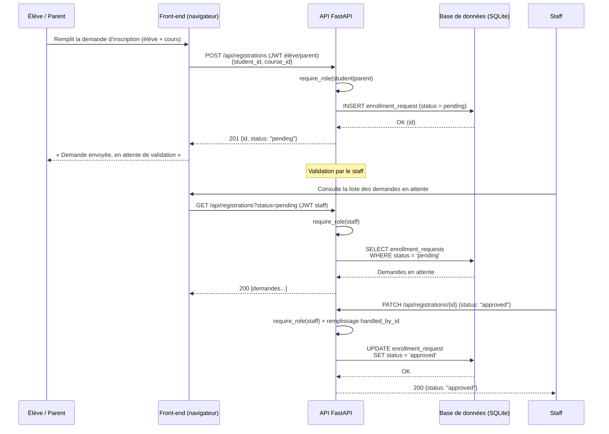
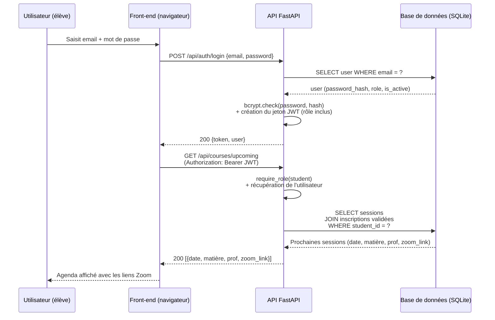
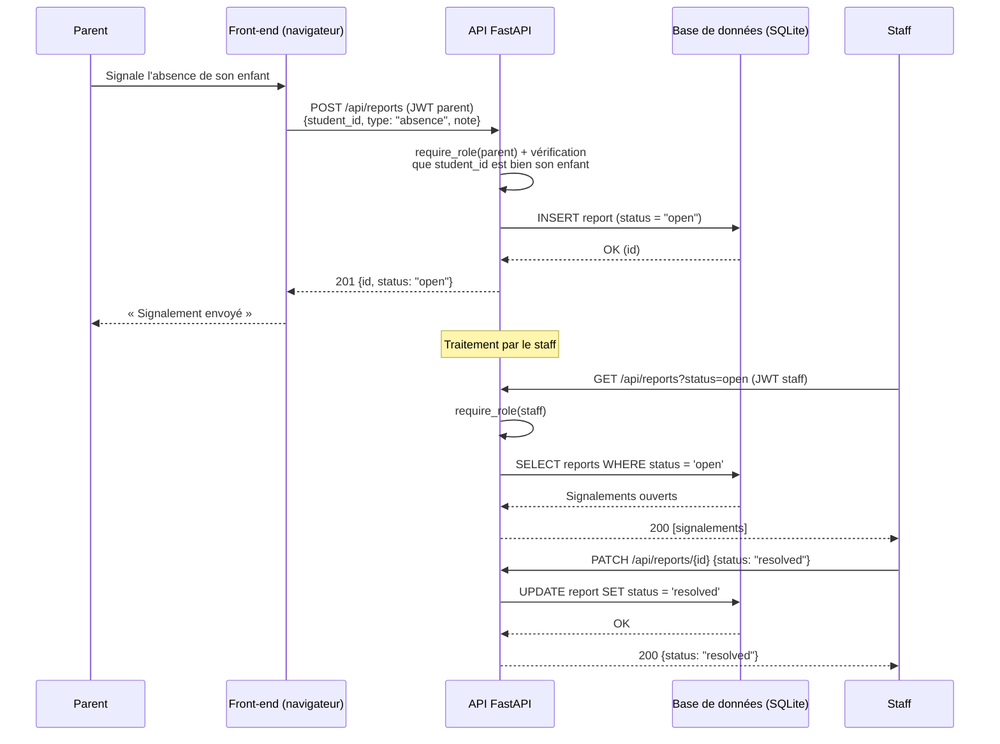

# Documentation technique — Portfolio Project (Stage 3)

Plateforme de cours pour association scolaire

Le présent document constitue la documentation technique du projet Portfolio (Stage 3) : une plateforme de cours à distance destinée à une association scolaire. Le MVP permet d'organiser des cours à distance le week-end pour environ 100 élèves et 10 professeurs. La solution s'appuie sur une stack FastAPI + SQLAlchemy + SQLite + JWT, avec une interface HTML/JavaScript native.

## 4. Diagrammes de séquence (interactions clés)

### 4.1 Vue d'ensemble des cas d'utilisation

Trois cas d'utilisation essentiels couvrent les interactions clés entre le front-end (navigateur), l'API FastAPI et la base de données SQLite :

| # | Cas d'utilisation | Acteurs | Entités (section 3) |
| --- | --- | --- | --- |
| 1 | **Inscription d'un élève → validation par le staff** | Élève / Parent, Staff | `EnrollmentRequest` |
| 2 | **Connexion JWT → consultation de l'agenda** | Élève | `User`, `CourseSession`, `EnrollmentRequest` |
| 3 | **Signalement d'absence → traitement par le staff** | Parent, Staff | `Report` |

---

### 4.2 Cas 1 — Inscription d'un élève → validation par le staff

L'élève (ou son parent) soumet une demande d'inscription via une route protégée par `require_role(student|parent)`. La demande est créée avec le statut `pending`, puis le staff la **liste**, l'**examine** et la **valide** (`approved`) ou la **rejette** (`rejected`).

---

### 4.3 Cas 2 — Connexion JWT → consultation de l'agenda (élève)

L'élève se connecte avec email + mot de passe ; l'API vérifie le hachage avec **bcrypt** et crée un **jeton JWT** (rôle inclus). Le jetón est ensuite utilisé sur `GET /api/courses/upcoming` : `require_role` contrôle l'accès et la base ne renvoie que les sessions issues d'inscriptions **validées**.

---

### 4.4 Cas 3 — Signalement d'absence (parent) → traitement (staff)

Le parent signale l'absence ou le retard de son enfant. L'API **vérifie que l'élève est bien son enfant** (permission par rôle via la couche service) avant de créer le signalement avec le statut `open`. Le staff liste les signalements ouverts, puis les traite (`resolved`).

---

### 4.5 Synthèse des interactions

| Cas | Rôles | Écriture (POST/PATCH) | Lecture (GET) | Entité |
| --- | --- | --- | --- | --- |
| 1. Inscription | student, parent, staff | `POST /api/registrations` · `PATCH /api/registrations/{id}` | `GET /api/registrations?status=pending` (staff) | `EnrollmentRequest` |
| 2. Connexion → agenda | student | `POST /api/auth/login` | `GET /api/courses/upcoming` (JWT) | `User`, `CourseSession` |
| 3. Signalement | parent, staff | `POST /api/reports` · `PATCH /api/reports/{id}` | `GET /api/reports?status=open` (staff) | `Report` |

**Principes communs aux trois diagrammes :**

- Toutes les routes (sauf `auth/login`) exigent un **jeton JWT** dans l'en-tête `Authorization`.
- Le **contrôle d'accès** est centralisé par la dépendance `require_role` sur chaque route.
- Les **permissions métier** (un parent ne concerne que ses enfants, un staff valide) sont vérifiées **avant** toute lecture/écriture en base.
- Le navigateur n'accède **jamais directement** à la base : toute interaction passe par l'API, en cohérence avec l'architecture (section 2) et les classes (section 3).
