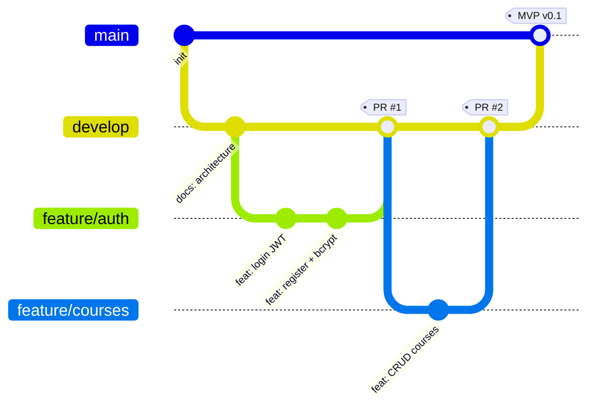
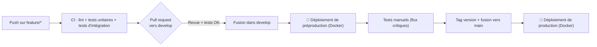

# Documentation technique — Portfolio Project (Stage 3)

Plateforme de cours pour association scolaire

Le présent document constitue la documentation technique du projet Portfolio (Stage 3) : une plateforme de cours à distance destinée à une association scolaire. Le MVP permet d'organiser des cours à distance le week-end pour environ 100 élèves et 10 professeurs. La solution s'appuie sur une stack FastAPI + SQLAlchemy + SQLite + JWT, avec une interface HTML/JavaScript native.

## 6. Stratégie de gestion de code source (SCM) et assurance qualité (QA)

### 6.1 Gestion de code source (SCM)

#### 6.1.1 Outil de contrôle de version

**Git** est utilisé pour le contrôle de version, hébergé sur un dépôt distant (GitHub). Git est choisi pour sa standardisation, sa gestion robuste des branches et l'intégration native des pull requests et des revues de code.

#### 6.1.2 Stratégie de branchement (Git Flow simplifié)

Trois niveaux de branches forment la stratégie de branchement :

| Branche | Rôle | Description |
| --- | --- | --- |
| `main` | Production | Code stable et livrable ; chaque fusion correspond à une version publiée |
| `develop` | Intégration | Branche de développement ; regroupe les fonctionnalités validées avant publication |
| `feature/*` | Développement | Une branche par tâche : `feature/auth`, `feature/courses`, `feature/attendance`, `feature/reports`, `feature/messages` |

**Règles de branchement :**

- Une **branche de fonctionnalité** (`feature/*`) est créée depuis `develop` pour chaque tâche du projet.
- Le **code est fusionné dans `develop` uniquement via pull request** après revue de code.
- `develop` est **fusionné dans `main`** pour chaque version stable (jalon ou MVP).
- `main` ne reçoit jamais de commit direct.

#### 6.1.3 Commits réguliers et conventions

- **Commits fréquents et atomiques** : un commit = une unité logique de travail, avec des messages clairs en anglais.
- **Convention de nommage (Conventional Commits)** :

| Préfixe | Usage | Exemple |
| --- | --- | --- |
| `feat:` | Nouvelle fonctionnalité | `feat: add attendance endpoint` |
| `fix:` | Correction de bug | `fix: handle 401 on expired token` |
| `docs:` | Documentation | `docs: document /auth endpoints` |
| `refactor:` | Refactorisation | `refactor: extract service layer` |
| `test:` | Tests | `test: add auth unit tests` |
| `chore:` | Tâche technique | `chore: configure pytest` |

#### 6.1.4 Revues de code et pull requests

- **Chaque feature** fait l'objet d'une **pull request** vers `develop`.
- La PR décrit : la tâche traitée, les changements, les tests effectués, et l'état des tests CI.
- **Exigences avant fusion** :
  - Au moins une revue de code approuvée.
  - Les tests automatisés passent (CI).
  - Pas de conflit avec `develop`.
- Le **créateur de la PR ne la fusionne pas lui-même** (revue croisée).

#### 6.1.5 Tags et versions

- Chaque fusion vers `main` est **taggée** avec la convention sémantique : `v0.1.0` (jalon doc), `v1.0.0` (MVP livré).
- Format SemVer : `MAJEUR.MINEUR.PATCH`.

---

### 6.2 Assurance qualité (QA)

#### 6.2.1 Stratégie de test (par niveaux)

| Niveau | Objet | Portée | Cible |
| --- | --- | --- | --- |
| **Tests unitaires** | Logique métier isolée | Couche service, validation, permissions par rôle | ~75-80 % de couverture sur les services |
| **Tests d'intégration** | Points de terminaison API | Routes FastAPI + base de données (SQLite de test) | Tous les endpoints (succès + erreurs) |
| **Tests manuels** | Flux utilisateur critiques | Parcours complet dans le navigateur | Inscription → cours → assiduité |

> Cible de couverture revue à la baisse (75-80 % au lieu de 90 %) pour rester réaliste sur un projet solo dans le délai imparti ; l'effort est concentré sur la couche service (permissions, calcul de majorité) plutôt que sur une couverture exhaustive.

#### 6.2.2 Outils de test

| Outil | Usage | Exemple d'application |
| --- | --- | --- |
| **pytest** | Framework de tests Python (unitaires + intégration) | Tests de la couche service et des endpoints FastaAPI |
| **httpx** | Client HTTP pour tester les routes FastAPI (TestClient) | Appel réel des endpoints avec jeton JWT |
| **SQLite de test** | Base dédiée aux tests (fixtures SQLAlchemy) | Isolation des données, reset entre les tests |
| **Postman** | Collection de tests manuels / smoke tests de l'API | Vérifier le flux login → agenda → assiduité à la main (chemins `/api/...`) |
| **(Option CI) GitHub Actions** | Pipeline automatisé | Lancer pytest à chaque push / PR |

#### 6.2.3 Tests unitaires — exemples ciblés

- **Couche service** : permission « un parent n'accède qu'aux données de ses enfants » ; « un professeur ne modifie que ses propres cours ».
- **Validation** : email invalide, mot de passe trop court, rôle inconnu → erreurs 422.
- **Sécurité** : hachage bcrypt (mot de passe jamais stocké en clair), jeton expiré → 401.
- **Contrôle des rôles à la création de compte** : `role` forcé côté serveur sur `/api/staff/teachers` (jamais accepté depuis le body appelant), rejet de `role=teacher|staff` sur `/api/auth/register`.

#### 6.2.4 Tests d'intégration — scénarios API

| Scénario | Déroulé | Résultat attendu |
| --- | --- | --- |
| Connexion réussie | POST /api/auth/login (identifiants valides) | 200 + jeton JWT |
| Connexion refusée | POST /api/auth/login (mauvais mot de passe) | 401 |
| Accès sans jeton | GET /api/courses/upcoming sans Authorization | 401 |
| Rôle insuffisant | POST /api/courses en tant que student | 403 |
| Création de cours | POST /api/courses en tant que teacher | 201 (ligne en base) |
| Création de session | POST /api/courses/{id}/sessions (date + zoom_link) | 201 (ligne en base) |
| Consultation de l'agenda | GET /api/courses/upcoming en tant qu'élève (inscriptions validées) | 200, sessions attendues |
| Saisie assiduité | POST /api/attendance pour un cours du prof | 201 ; relecture en base |
| Suivi de progression | POST /api/progress (student_id, course_id, level) | 201 ; relecture en base |
| Assiduité d'un enfant | GET /api/students/{id}/attendance en tant que parent | 200, records de l'enfant |
| Signalement d'absence | POST /api/reports (parent → son enfant) | 201, status open |
| Validation inscription | PATCH /api/registrations/{id} en tant que staff | 200, status approved |
| Création compte prof par staff | POST /api/staff/teachers en tant que staff | 201, role = "teacher" |
| Élévation de privilège refusée | POST /api/auth/register avec role="teacher" | 403 |
| Suivi disponibilité prof | GET /api/teachers/{id}/activity en tant que staff | 200, agrégat cohérent avec les cours/sessions du prof |
| Suivi disponibilité — accès refusé | GET /api/teachers/{id}/activity en tant que teacher ou parent | 403 |

#### 6.2.5 Tests manuels — flux critiques

| Flux | Étapes | Points de contrôle |
| --- | --- | --- |
| Inscription → agenda | Register élève → login → consulter agenda | Agenda vide, puis rempli après inscription validée |
| Cycle d'inscription | Parent demande → staff approuve → l'élève voit le cours | Statut change en chaîne (pending → approved) |
| Assiduité prof | Prof crée un cours → saisit l'assiduité | Le parent voit l'assiduité de son enfant |
| Signalement | Parent signale un retard → staff traite | Statut open → processing → resolved |

---

### 6.3 Pipeline de déploiement (CI/CD)

| Étape | Environnement | Déclencheur | Actions |
| --- | --- | --- | --- |
| 0. Développement local | Local (sans Docker, `uvicorn` direct) | — | Développement itératif rapide sur `feature/*` |
| 1. CI | — | Push sur une branche `feature/*` | `pytest` (unitaires + intégration), lint |
| 2. Revue | GitHub | Pull request vers `develop` | Revue de code + vérification CI verte |
| 3. **Préproduction** | Staging — conteneur Docker, SQLite / paramètres de test | Fusion dans `develop` | Build de l'image Docker, déploiement automatique, tests manuels, smoke tests Postman |
| 4. **Production** | Prod — conteneur Docker, SQLite en v1 / PostgreSQL en v2 | Fusion `develop` → `main` + tag | Déploiement du MVP (même image Docker que la préprod), vérification des variables d'environnement |

**Sécurité du pipeline :**

- **Les secrets** (clé JWT, secret webhook HelloAsso) ne sont jamais versionnés ; ils sont stockés dans des variables d'environnement.
- Le **webhook HelloAsso** n'est activé qu'en production (phase 3) avec vérification de signature.

> ⚠️ **Aucun déploiement automatique vers la production** tant que la phase 1 n'est pas validée de bout en bout : la fusion `develop` → `main` reste une action manuelle, déclenchée après validation des tests manuels en préproduction.

---

### 6.4 Synthèse

| Domaine | Décision |
| --- | --- |
| Outil SCM | Git + dépôt distant (GitHub) |
| Branchement | `main` / `develop` / `feature/*` (Git Flow simplifié) |
| Intégration | Pull request + revue de code obligatoire avant fusion |
| Commits | Conventionnels (`feat:`, `fix:`, `docs:`…) et atomiques |
| Versions | SemVer (`v0.1.0`, `v1.0.0`) taguées sur `main` |
| Tests unitaires | pytest (couche service, permissions, validation, contrôle des rôles) — cible ~75-80 % |
| Tests d'intégration | pytest + httpx (tous les endpoints API, y compris élévation de privilège) |
| Tests manuels | Flux critiques via Postman + navigateur |
| Pipeline | CI sur chaque push → build Docker → préproduction → production |
| Environnements | Local sans Docker ; préproduction et production conteneurisées (Docker), secrets en variables d'environnement |
