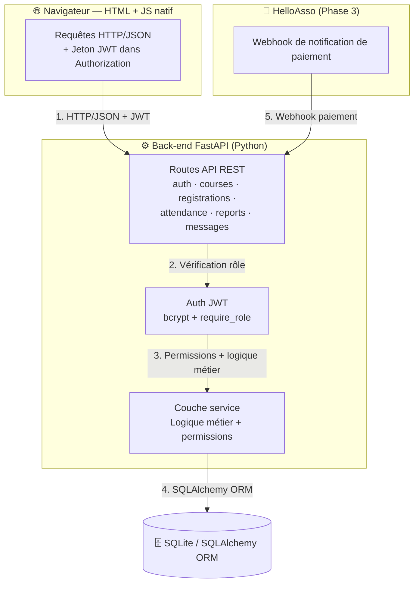
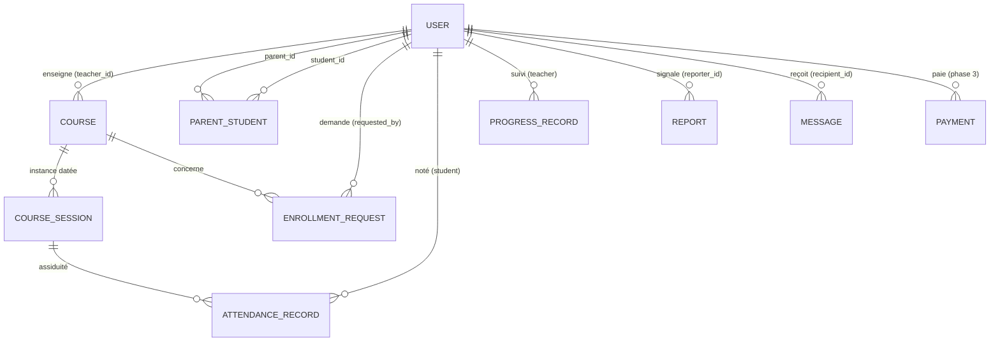
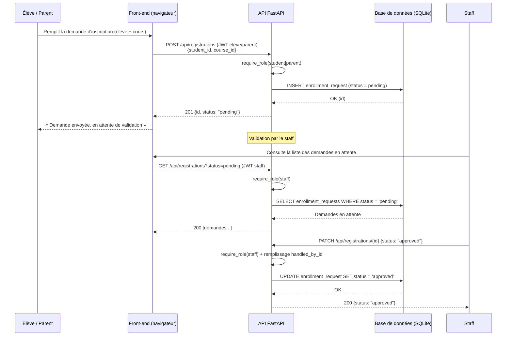
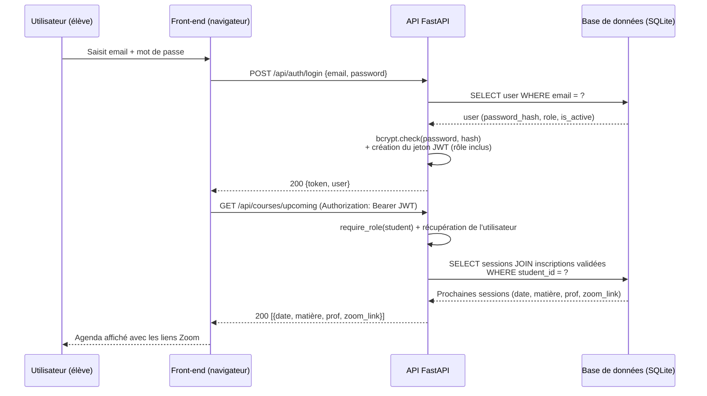
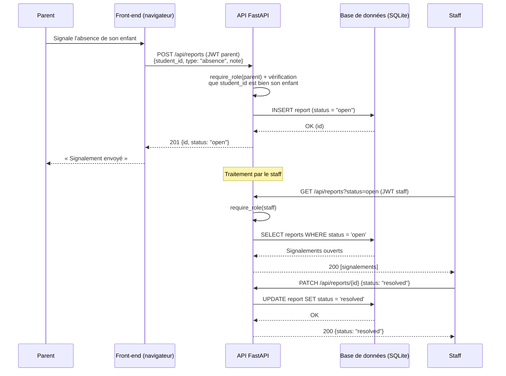

# Documentation technique — Portfolio Project (Stage 3)

Plateforme de cours pour association scolaire

Le présent document constitue la documentation technique finale du projet Portfolio (Stage 3) : une plateforme de cours à distance destinée à une association scolaire. Le MVP permet d'organiser des cours à distance le week-end pour environ 100 élèves et 10 professeurs. La solution s'appuie sur une stack FastAPI + SQLAlchemy + SQLite + JWT, avec une interface HTML/JavaScript native.

---

## Sommaire

1. [User stories et maquettes](#1-user-stories-et-maquettes)
2. [Architecture système](#2-architecture-système)
3. [Composants, classes et conception de la base de données](#3-composants-classes-et-conception-de-la-base-de-données)
4. [Diagrammes de séquence](#4-diagrammes-de-séquence)
5. [Spécifications des API](#5-spécifications-des-api)
6. [Stratégies SCM et QA](#6-stratégies-scm-et-qa)
7. [Justifications techniques](#7-justifications-techniques)

---

## 1. User stories et maquettes

### 1.1 User stories priorisées (MoSCoW)

**MUST HAVE — Incontournable**

- En tant qu'élève, je veux m'inscrire à un cours (seul ou via un parent), afin de rejoindre les sessions à distance.
- En tant qu'élève, je veux consulter mon agenda et le lien Zoom de chaque session, afin de me connecter au bon moment.
- En tant que parent, je veux demander l'inscription de mon enfant, afin qu'il suive les cours le week-end.
- En tant que parent, je veux suivre la progression et l'assiduité de mon enfant, afin de vérifier ses progrès.
- En tant que professeur, je veux créer mes cours et renseigner l'assiduité et la progression de mes élèves, afin d'assurer le suivi pédagogique.
- En tant que staff, je veux valider les demandes d'inscription et créer les comptes professeurs, afin de contrôler les accès à la plateforme.
- En tant que staff, je veux envoyer un message à un parent ou à un élève majeur, afin de diffuser une information.

**SHOULD HAVE — Devrait avoir**

- En tant que parent, je veux signaler un retard ou une absence de mon enfant, afin d'informer l'équipe.
- En tant que staff, je veux suivre l'assiduité et la disponibilité des professeurs (donnée réservée au staff), afin de garantir la tenue des cours. *(couvert par `GET /api/teachers/{id}/activity`)*
- En tant que staff, je veux traiter les signalements, afin de clôturer le suivi.

**COULD HAVE — Pourrait avoir**

- En tant que staff ou élève majeur, je veux initialiser une demande de cotisation (HelloAsso), afin d'automatiser le paiement (phase 3).
- En tant que professeur, je veux recevoir une notification lorsqu'un élève s'inscrit à mon cours, afin d'anticiper l'effectif.

**WON'T HAVE — N'aura pas (MVP)**

- La messagerie en temps réel (fil de discussion) est exclue : la messagerie reste descendante, de l'équipe vers les familles.
- L'intégration de l'API Zoom est exclue : le lien est saisi manuellement par le professeur.
- L'application mobile native est exclue du MVP.

### 1.2 Maquettes des écrans principaux (wireframes)

Wireframes basse-fidélité fournis dans `maquettes.html` (fichier séparé). Légende fonctionnelle :

- **Connexion / Inscription** (tous) : formulaire email, mot de passe, rôle (élève/parent), date de naissance pour les élèves.
- **Agenda élève** : liste des prochaines sessions avec date, matière, professeur et lien Zoom cliquable ; cours disponibles avec demande d'inscription.
- **Portail parent** : un onglet par enfant, agenda, assiduité, progression et bouton « Signaler absence/retard ».
- **Tableau de bord professeur** : gestion des cours (matière, jour, heure, lien Zoom), liste des élèves inscrits, saisie de l'assiduité et de la progression.
- **Administration (staff)** : validation des demandes d'inscription, création des comptes professeurs, traitement des signalements, envoi de messages, et suivi de l'activité/disponibilité des professeurs.

---

## 2. Architecture système

### 2.1 Vue d'ensemble

L'architecture repose sur une séparation stricte en trois couches : un client léger (navigateur), un back-end applicatif (FastAPI) et un système de stockage (SQLite via SQLAlchemy). Un service externe (HelloAsso) s'intègre en phase 3 uniquement, via webhook.

### 2.2 Composants

| # | Composant | Technologie | Rôle |
| --- | --- | --- | --- |
| 1 | Navigateur | HTML + JS natif | Envoie des requêtes HTTP/JSON vers l'API, avec un jeton JWT dans l'en-tête `Authorization` sur les routes protégées |
| 2 | Back-end | FastAPI (Python) | Routes API REST (auth, courses, registrations, attendance, reports, messages), authentification JWT (bcrypt + `require_role`), couche service (logique métier + permissions) |
| 3 | Base de données | SQLite / SQLAlchemy ORM | Stockage persistant ; évolution vers PostgreSQL possible sans réécriture du code métier |
| 4 | Services externes | HelloAsso (phase 3) | Webhook de notification de paiement |

### 2.2.1 Conteneurisation (Docker)

Le back-end FastAPI est packagé en **image Docker** pour les environnements de préproduction et de production, garantissant un environnement d'exécution identique aux deux étapes. Le développement local peut s'effectuer sans Docker (`uvicorn` direct) pour un cycle plus rapide. SQLite est monté en volume en v1 ; le passage à PostgreSQL en v2 ajoute un conteneur base de données, sans changement du code métier grâce à l'ORM SQLAlchemy.

### 2.3 Flux de données

1. Le navigateur envoie des requêtes HTTP/JSON vers l'API FastAPI, avec un jeton JWT dans l'en-tête `Authorization` sur les routes protégées.
2. La dépendance `require_role` vérifie le rôle avant d'exécuter toute action ; le rôle est présent dans le jeton et re-vérifié en base si nécessaire.
3. La couche service applique les permissions par rôle (un parent n'accède qu'aux données de ses enfants) puis interroge la base via SQLAlchemy.
4. SQLite stocke les données (évolution vers PostgreSQL sans réécriture, grâce à l'ORM).
5. Phase 3 : HelloAsso reçoit le paiement et notifie le back-end via webhook.

---

## 3. Composants, classes et conception de la base de données

### 3.1 Classes principales (back-end — SQLAlchemy + FastAPI)

| Classe | Champs | Rôle |
| --- | --- | --- |
| `User` | id, email, password_hash, role (student/parent/teacher/staff), first_name, last_name, birth_date, is_active, last_login | Compte générique ; majorité calculée via `birth_date` ; `last_login` alimente le suivi d'activité des profs (5.2.2) |
| `ParentStudent` (table d'association) | parent_id, student_id | Relation N:N parent ↔ enfant |
| `Course` | id, teacher_id, title, subject, day_of_week, start_time, end_time, zoom_link | Cours hebdomadaire créé par le prof |
| `EnrollmentRequest` | id, student_id, course_id, requested_by_id, status (pending/approved/rejected), handled_by_id | Demande d'inscription soumise au staff |
| `CourseSession` | id, course_id, date, zoom_link | Instance datée d'un cours (pour l'assiduité) |
| `AttendanceRecord` | id, session_id, student_id, status (present/absent/late), note | Assiduité renseignée par le prof |
| `ProgressRecord` | id, student_id, course_id, teacher_id, level, note, date | Suivi de progression |
| `Report` | id, reporter_id, student_id, type (absence/late), status (open/processing/resolved), note | Signalement parent/élève majeur → staff |
| `Message` | id, sender_id, recipient_id, title, body, sent_at | Messagerie descendante staff → parent OU élève majeur |
| `Payment` (phase 3) | id, student_id, amount, helloasso_payment_id, status | Cotisation HelloAsso |

#### 3.1.1 Méthodes clés par classe

Seules les méthodes porteuses de logique métier sont listées ; les opérations CRUD triviales sont gérées implicitement par l'ORM.

| Classe | Méthode | Rôle |
| --- | --- | --- |
| `User` | `verify_password(plain_password) -> bool` | Compare au `password_hash` via bcrypt |
| `User` | `is_adult() -> bool` | Majorité calculée à la volée depuis `birth_date` |
| `User` | `generate_token() -> str` | Construit le JWT signé (rôle inclus) |
| `Course` | `add_session(date, zoom_link=None) -> CourseSession` | Crée une instance datée du cours |
| `Course` | `is_owned_by(teacher_id) -> bool` | Permission : le cours appartient-il à ce professeur ? |
| `CourseSession` | `effective_zoom_link() -> str` | Lien de session si renseigné, sinon lien du cours parent |
| `EnrollmentRequest` | `approve(handled_by_id)` / `reject(handled_by_id)` | Change le statut et trace l'action du staff |
| `Report` | `resolve(handled_by_id)` | Passe le signalement à `resolved` |
| `Payment` (phase 3) | `update_status(helloasso_status)` | Met à jour le statut depuis le webhook |

`ParentStudent`, `AttendanceRecord`, `ProgressRecord`, `Message` : entités de données pures, sans méthode métier propre (permissions portées par la couche service).

### 3.2 Relations principales (ERD)

- `USER` 1—N `COURSE` : un professeur enseigne plusieurs cours.
- `COURSE` 1—N `COURSE_SESSION` : un cours a plusieurs instances datées.
- `USER` N—N `PARENT_STUDENT` : un enfant peut avoir deux parents.
- `USER` 1—N `ENROLLMENT_REQUEST` ; `COURSE` 1—N `ENROLLMENT_REQUEST`.
- `COURSE_SESSION` 1—N `ATTENDANCE_RECORD` ; `USER` 1—N `ATTENDANCE_RECORD`.
- `USER` 1—N `PROGRESS_RECORD` (suivi, rôle teacher) ; `USER` 1—N `REPORT` (signale).
- `USER` 1—N `MESSAGE` (reçoit) ; `USER` 1—N `PAYMENT` (paie, phase 3).

### 3.3 Détail des tables

| Table | Champs | Contraintes & notes |
| --- | --- | --- |
| `users` | id, email, password_hash, role, first_name, last_name, birth_date, is_active, last_login, created_at | `email` **unique** |
| `parent_student` | parent_id, student_id | Clé primaire **composite** ; FKs → users |
| `courses` | id, teacher_id, title, subject, day_of_week, start_time, end_time, zoom_link | `teacher_id` FK → users |
| `enrollment_requests` | id, student_id, course_id, requested_by_id, status, handled_by_id, created_at | 4 FKs → users / courses |
| `course_sessions` | id, course_id, date, zoom_link | `course_id` FK ; `zoom_link` nullable (voir 3.5) |
| `attendance_records` | id, session_id, student_id, status, note, created_at | FKs → course_sessions / users |
| `progress_records` | id, student_id, course_id, teacher_id, level, note, date | 3 FKs → users / courses |
| `reports` | id, reporter_id, student_id, type, status, note, created_at, handled_by_id | FKs → users |
| `messages` | id, sender_id, recipient_id, title, body, sent_at | FKs → users |
| `payments` (phase 3) | id, student_id, amount, helloasso_payment_id, status, date | `student_id` FK |

### 3.4 Front-end (composants et interactions)

`api_client.js` centralise l'injection du jeton JWT (`Authorization: Bearer <token>`) et la gestion des `401` (redirection vers `login`) pour toutes les pages.

| Page | Endpoints appelés |
| --- | --- |
| `login` | `POST /api/auth/login` |
| `register` | `POST /api/auth/register` (élève/parent uniquement) |
| `agenda` (élève) | `GET /api/courses/upcoming`, `GET /api/courses`, `POST /api/registrations` |
| `parent` | `GET /api/courses/upcoming`, `GET /api/students/{id}/attendance`, `POST /api/registrations`, `POST /api/reports` |
| `prof` | `GET /api/courses`, `POST /api/courses`, `POST /api/courses/{id}/sessions`, `POST /api/attendance`, `POST /api/progress` |
| `admin` (staff) | `GET/PATCH /api/registrations`, `POST /api/staff/teachers`, `GET/PATCH /api/reports`, `POST /api/messages`, `GET /api/teachers/{id}/activity` |

Après connexion, la page de destination est déterminée par le rôle renvoyé par l'API.

### 3.5 Décisions de conception

- Majorité calculée à partir de `birth_date` (jamais périmée).
- Un seul système `Message` cible n'importe quel utilisateur (parent ou élève majeur) — pas de cas particulier à maintenir.
- `handled_by_id` sur les demandes et signalements : traçabilité de l'action du staff.
- `CourseSession` séparé de `Course` : le cours récurrent est l'« abonnement », la session est l'instance datée qui porte l'assiduité.
- **`zoom_link` sur `Course` et `CourseSession`** : `Course.zoom_link` est le lien récurrent par défaut ; `CourseSession.zoom_link` (nullable) permet de le surcharger ponctuellement (rattrapage, changement de salle virtuelle). L'API retombe sur `Course.zoom_link` si celui de la session est vide — ce n'est pas une redondance mais un mécanisme de surcharge.

---

## 4. Diagrammes de séquence

### 4.1 Inscription d'un élève → validation par le staff

### 4.2 Connexion JWT → consultation de l'agenda (élève)

### 4.3 Signalement d'absence (parent) → traitement (staff)

---

## 5. Spécifications des API

### 5.1 API externes

| API | Statut | Description | Pourquoi ce choix |
| --- | --- | --- | --- |
| **HelloAsso** | Phase 3 (hors MVP) | Formulaires de cotisation + webhook de notification de paiement | Pensée pour les associations françaises (gratuite, reçus fiscaux) ; intégration par webhook d'une complexité identique à Stripe |
| **API Zoom** | **Écartée au MVP** | — | Lien Zoom saisi manuellement par le prof — aucune dépendance externe indispensable |

### 5.2 API internes (REST, JSON)

API **REST** exposée par FastAPI sous le préfixe `/api`. Authentification par jeton JWT (`Authorization: Bearer <token>`), rôles vérifiés par `require_role` (student, parent, teacher, staff).

| Méthode | Chemin | Accès | Entrée | Sortie |
| --- | --- | --- | --- | --- |
| `POST` | `/api/auth/register` | public | `{email, password, first_name, last_name, role: student\|parent, birth_date?}` | `201 {id, email, role}` |
| `POST` | `/api/auth/login` | public | `{email, password}` | `200 {token, user}` |
| `GET` | `/api/auth/me` | tous | — | `200 {user}` |
| `POST` | `/api/staff/teachers` | staff | `{email, password, first_name, last_name}` | `201 {id, email, role:"teacher"}` |
| `GET` | `/api/courses` | tous connectés | `?subject=` | `200 [courses]` |
| `POST` | `/api/courses` | teacher, staff | `{title, subject, day_of_week, start_time, end_time, zoom_link, teacher_id?}` | `201 {course}` |
| `POST` | `/api/courses/{id}/sessions` | teacher, staff | `{date, zoom_link?}` | `201 {session}` |
| `GET` | `/api/courses/upcoming` | student, parent | — | `200 [{date, title, zoom_link}]` |
| `POST` | `/api/registrations` | student, parent | `{course_id, student_id?}` | `201 {id, status:"pending"}` |
| `GET` | `/api/registrations` | staff | `?status=pending` | `200 [demandes]` |
| `PATCH` | `/api/registrations/{id}` | staff | `{status: approved\|rejected}` | `200 {status}` |
| `GET` | `/api/students/{id}/attendance` | parent (son enfant), teacher, staff | — | `200 [attendance_records]` |
| `POST` | `/api/attendance` | teacher | `{session_id, student_id, status, note?}` | `201 {record}` |
| `POST` | `/api/progress` | teacher | `{student_id, course_id, level, note?}` | `201 {record}` |
| `GET` | `/api/teachers/{id}/activity` | staff | — | `200 {courses_count, sessions_last_30d, last_attendance_entry, last_login}` |
| `POST` | `/api/reports` | parent, student (majeur) | `{student_id, type, note?}` | `201 {report}` |
| `GET` | `/api/reports` | staff | `?status=open` | `200 [reports]` |
| `PATCH` | `/api/reports/{id}` | staff | `{status}` | `200 {status}` |
| `POST` | `/api/messages` | staff | `{recipient_id, title, body}` | `201 {message}` |
| `GET` | `/api/messages` | tous | — | `200 [messages reçus]` |
| `POST` | `/api/webhooks/helloasso` (phase 3) | webhook signé | payload HelloAsso | `200 {received}` |

#### 5.2.1 Règles de contrôle des rôles à la création de compte

- **`/api/auth/register`** est restreint aux rôles `student` et `parent`. Toute tentative de création avec `role: teacher` ou `role: staff` renvoie `403 Forbidden`.
- **`/api/staff/teachers`** est le seul point d'entrée pour créer un compte professeur. Le rôle `teacher` est **forcé côté serveur**, jamais fourni dans le body par l'appelant.
- **`teacher_id` sur `POST /api/courses`** : ignoré et forcé à l'utilisateur courant si l'appelant est `teacher` ; obligatoire dans le body si l'appelant est `staff` (`422` si absent).

#### 5.2.2 Suivi de la disponibilité des professeurs

`GET /api/teachers/{id}/activity` répond à la user story SHOULD HAVE « Staff : suivre l'assiduité et la disponibilité des professeurs ». Aucune nouvelle table : agrégation de données existantes (cours actifs, sessions créées sur 30 jours, dernière saisie d'assiduité, `users.last_login`). Réservé au rôle `staff`.

### 5.3 Documentation interactive

La documentation API interactive est générée automatiquement par FastAPI sur `/docs` (OpenAPI/Swagger).

---

## 6. Stratégies SCM et QA

### 6.1 SCM (Git/GitHub)

- **Branches** : `main` (stable, taguée) ← `develop` ← `feature/<nom>` (une branche par fonctionnalité).
- **Conventions de commits** : `feat:`, `fix:`, `docs:`, `test:`, `refactor:` (Conventional Commits).
- **Pull Requests** : revue systématique avant merge dans `develop` ; merges vers `main` uniquement à la fin de chaque phase (1 → 2 → 3).
- **Hygiène** : `.env` et secrets jamais commités (`.gitignore`) ; migrations SQLAlchemy versionnées ; tags de version (`v0.1.0`...).

### 6.2 QA

- **Tests unitaires (pytest)** : services (calcul de la majorité, permissions, contrôle des rôles à la création de compte) — cible ~75-80 % de couverture sur les services (ajustée pour rester réaliste sur un projet solo).
- **Tests d'intégration API (pytest + FastAPI TestClient)** : chaque endpoint, auth, CRUD, statuts, tentatives d'élévation de privilège.
- **Tests de sécurité des rôles (pytest)** : un parent ne peut PAS lire les données d'un élève qui n'est pas le sien ; routes protégées par `require_role` ; `/api/auth/register` refuse `role=teacher|staff`.
- **Tests manuels E2E (checklist rejouable)** : création prof (via staff) → cours → inscription élève → agenda côté élève → signalement → traitement staff.

### 6.3 Pipeline de déploiement

**local (dev, sans Docker)** → **staging** (conteneur Docker, données de recette) → **production** (même image Docker, bascule PostgreSQL si nécessaire).

> ⚠️ **Aucun déploiement automatique vers la prod** tant que la phase 1 n'est pas validée de bout en bout ; la fusion `develop` → `main` reste une action manuelle après validation des tests en préproduction.

---

## 7. Justifications techniques

| Choix | Justification |
| --- | --- |
| **Back-end : Python + FastAPI** | Démarrage minimal, validation automatique (Pydantic), documentation `/docs` automatique |
| **Base de données : SQLite (SQLAlchemy)** | Zéro installation serveur pour le MVP ; migration PostgreSQL sans réécriture |
| **Authentification : JWT + bcrypt** | Standard simple, rôle vérifié à chaque requête (`require_role`) |
| **Front-end : HTML + JS natif** | Suffisant pour 2 écrans principaux, pas de complexité de build |
| **Paiement : HelloAsso (phase 3)** | Gratuit pour les associations FR, reçus fiscaux, webhook = même complexité que Stripe |
| **Zoom : lien manuel** | Pas d'API Zoom au MVP — évite une dépendance externe non indispensable |
| **Création de compte prof restreinte au staff** | Empêche toute élévation de privilège via l'inscription publique |
| **Docker en préproduction/production** | Environnement reproductible, prépare la bascule PostgreSQL sans changer le code applicatif |
| **Architecture : 3 phases** | Livrable fonctionnel et démontrable à chaque étape |
